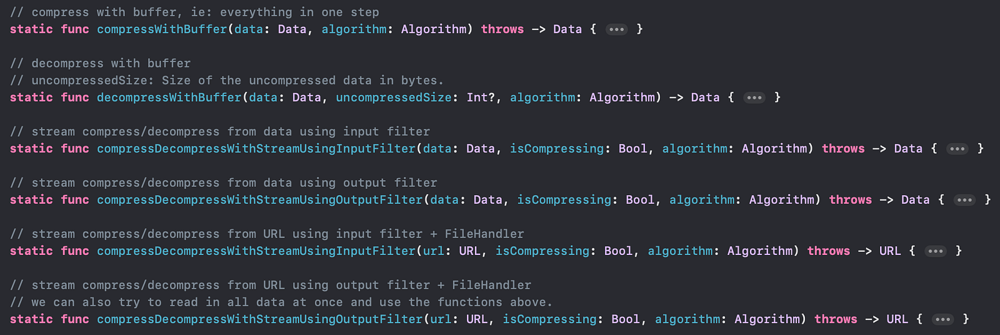

# Swift_DataCompressionDemo

A demo of performing Data Compression with [Compression](https://developer.apple.com/documentation/compression) framework. 

- Buffer compression
- Stream compression with InputFilter and OutputFilter
  - Directly From Data
  - From File using file handler

